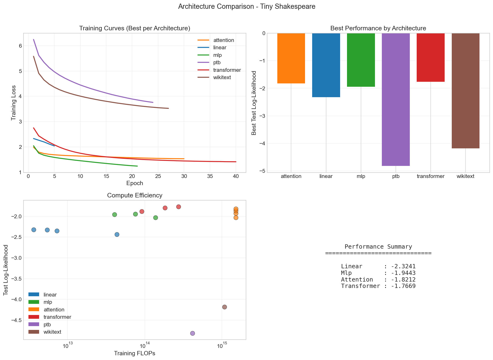
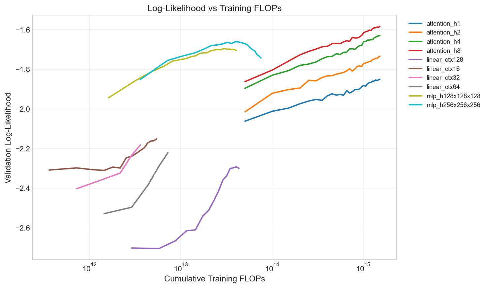

#  Tiny Language Models


A from-scratch implementation of progressively complex language model architectures, comparing their performance and compute efficiency on character-level and word-level text prediction tasks.



##  Project Overview

This project investigates how architectural complexity affects language model quality by implementing and comparing:

| Model | Description | Parameters |
|-------|-------------|------------|
| **Linear** | Softmax regression baseline | ~650K |
| **MLP** | 3-layer feedforward network | ~200K |
| **Self-Attention** | Multi-head causal attention | ~300K |
| **Transformer** | Full transformer blocks with FFN | ~1.5M |

### Key Findings

- **Transformers achieve the best log-likelihood** (-1.77) but require 100x more compute than MLPs
- **Self-attention alone** (without FFN) reaches -1.82, showing attention's power
- **Context length matters**: Linear models improve significantly from 16→128 tokens
- **Compute efficiency**: MLPs offer the best performance-per-FLOP for small budgets



##  Quick Start

### Installation

```bash
git clone https://github.com/yourusername/tiny-language-models.git
cd tiny-language-models
pip install -r requirements.txt
```

### Download Data

```bash
python scripts/download_data.py
```

This downloads:
- **Tiny Shakespeare** (~1MB) - Character-level
- **Penn Treebank** (~5MB) - Word-level  
- **WikiText-2** (~12MB) - Word-level

### Train Models

```bash
# Train all architectures with default settings
python scripts/train.py

# Train specific architecture
python scripts/train.py --model transformer --epochs 50

# Quick test run
python scripts/train.py --quick
```

### Generate Text

```bash
# Generate Shakespeare-style text
python scripts/generate.py --model transformer --prompt "HAMLET:" --length 200

# Generate from word-level model
python scripts/generate.py --model transformer --dataset ptb --prompt "the company announced"
```
### Interactive Mode
```bash
# Chat with your model interactively
python scripts/interactive.py

# Use different model or temperature
python scripts/interactive.py --model attention --temperature 0.5
```

Example session:
```
Prompt: ROMEO:
Generated:
------------------------------
ROMEO: O, she doth teach the torches to burn bright!
It seems she hangs upon the cheek of night
Like a rich jewel in an Ethiope's ear...
------------------------------

Prompt: temp 0.3
Temperature set to 0.3

Prompt: quit
Goodbye!
```

## Pre-trained Weights (Optional)
This is a work in progress. I am adding the link to my own pretrained weight files to be downloaded here. Ill mostly host on drive or as  Github release assets to avoid large repo size.


Pre-trained checkpoints are available if you want to skip training: 

| Model | Download | Size |
|-------|----------|------|
| Transformer (4 layers) | [Download](https://github.com/Anjali-Kan/tiny-language-models/releases/download/v1.0.0/transformer_L4.pt) | ~4MB |
| Transformer (2 layers) | [Download](https://github.com/Anjali-Kan/tiny-language-models/releases/download/v1.0.0/transformer_L2.pt) | ~2MB |
| Attention (4 heads) | [Download](https://github.com/Anjali-Kan/tiny-language-models/releases/download/v1.0.0/attention_h4.pt) | ~650KB |
| MLP (256×3) | [Download](https://github.com/Anjali-Kan/tiny-language-models/releases/download/v1.0.0/mlp_256x256x256.pt) | ~3MB |
| Linear (ctx=128) | [Download](https://github.com/Anjali-Kan/tiny-language-models/releases/download/v1.0.0/linear_ctx128.pt) | ~2MB |


 **Setup:**
```bash
# Download and place in results/ directory
mv ~/Downloads/*.pt results/

# Verify
python scripts/generate.py --prompt "HAMLET:" --model transformer
``` 

> **Note:** Although Checkpoints are not included in repo due to size. You can also train from scratch using `python scripts/train.py`

---

## Results

| Model | Parameters | Perplexity ↓ | Log-Likelihood ↑ | Training Time | FLOPs |
|-------|------------|--------------|------------------|---------------|-------|
| Linear (ctx=128) | ~650K | 10.3 | -2.33 | ~2 min | 10¹² |
| MLP (256×3) | ~200K | 7.0 | -1.94 | ~8 min | 10¹³ |
| Attention (4 heads) | ~300K | 6.2 | -1.82 | ~15 min | 10¹³ |
| **Transformer (4 layers)** | **~1.5M** | **5.9** | **-1.77** | ~45 min | 10¹⁴ |

> **Note:** Perplexity = exp(-log_likelihood). Lower is better.

### Test Log-Likelihood (higher is better)

| Architecture | Tiny Shakespeare | PTB | WikiText-2 |
|-------------|------------------|-----|------------|
| Linear (ctx=128) | -2.33 | - | - |
| MLP (256×3) | -1.94 | - | - |
| Attention (4 heads) | -1.82 | - | - |
| **Transformer (4 layers)** | **-1.77** | -4.70 | -4.21 |

### Sample Generations

**Prompt:** `HAMLET:`

**Linear Model:**
```
HAMLET: the the the and the to the...
```

**Transformer:**
```
HAMLET: What say you to this? I am not bound to please thee with my answer.
The king hath sent to know the truth of this...
```

##  Architecture Details

### Transformer Block
```
Input → LayerNorm → Multi-Head Attention → + → LayerNorm → FFN → + → Output
         ↑_______________________________↑      ↑_______________↑
                  (residual)                       (residual)
```

Key implementation features:
- **Causal masking** for autoregressive generation
- **Weight tying** between embedding and output layers
- **Cosine learning rate scheduling** with warmup
- **Gradient clipping** for stability

##  Project Structure

```
tiny-language-models/
├── src/
│   ├── models/          # Model architectures
│   │   ├── linear.py
│   │   ├── mlp.py
│   │   ├── attention.py
│   │   └── transformer.py
│   ├── data/            # Dataset loading & processing
│   ├── training/        # Training loop & evaluation
│   └── utils/           # Visualization & helpers
├── scripts/
│   ├── train.py         # Main training script
│   ├── generate.py      # Text generation
│   └── download_data.py # Dataset downloader
├── configs/
│   └── default.yaml     # Hyperparameters
└── results/
    └── figures/         # Generated plots
```

##  Configuration

Edit `configs/default.yaml` to customize:

```yaml
model:
  type: transformer
  embed_dim: 128
  n_heads: 4
  n_layers: 4
  dropout: 0.1

training:
  epochs: 50
  batch_size: 32
  learning_rate: 3e-4
  weight_decay: 0.01

data:
  context_length: 128
  dataset: shakespeare
```

##  Experiment Tracking

Training automatically logs:
- Loss curves (train/validation)
- Test log-likelihood
- Cumulative FLOPs
- Generated samples

Results are saved to `results/` as JSON for reproducibility.

##  Running Ablations

```bash
# Compare different context lengths
python scripts/train.py --model linear --context-lengths 16 32 64 128

# Compare attention heads
python scripts/train.py --model attention --heads 1 2 4 8

# Compare transformer depths
python scripts/train.py --model transformer --layers 2 4 6
```

##  References

- [Attention Is All You Need](https://arxiv.org/abs/1706.03762) - Vaswani et al.
- [Language Models are Unsupervised Multitask Learners](https://cdn.openai.com/better-language-models/language_models_are_unsupervised_multitask_learners.pdf) - GPT-2 Paper
- [The Annotated Transformer](https://nlp.seas.harvard.edu/2018/04/03/attention.html) - Harvard NLP

##  License

MIT License - feel free to use for learning and research.

##  Acknowledgments

Datasets used are publicly available benchmarks commonly used in NLP research.
